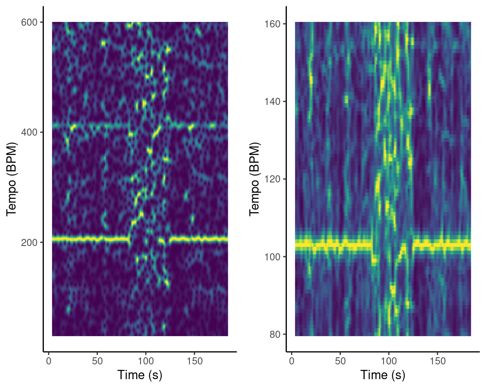

```{r setup, include=FALSE}
library(flexdashboard)
library(readr)
library(DT)
library(tidyverse)
library(tidymodels)
library(lubridate)
library(plotly)
library(spotifyr)
library(compmus)
library(gridExtra)
library(grid)
library(shiny)
library(ggdendro)
library(heatmaply)
library(png)

college_dropout <- get_playlist_audio_features("", "2vtt0OdzJ0bug332TuRCOr")
late_regestration <- get_playlist_audio_features("", "2UiJC8DaK3IL2QzJ9yFRKC")
graduation <- get_playlist_audio_features("", "3CjsM5gcnTmX6bnD5HvGzS")
heartbreak <- get_playlist_audio_features("", "2DI1sCSOuSZyVSahhkgL28")

ye <- get_artist_audio_features("Kanye west")

first_era <-
  bind_rows(
    college_dropout %>% mutate(category = "The College Dropout"),
    late_regestration %>% mutate(category = "Late Regestration"),
    graduation %>% mutate(category = "Graduation"),
    heartbreak %>% mutate(category = "808s & Heartbreak")
  )
```

Introduction
=====================================

Column {data-width=600}
-----------------------------------------------------------------------

### A technical deep dive into Ye's discography

In this repository I work on creating my portfolio for the optional course "Computational Musicology" for my bachelors program "Artificial Intelligence"

The corpus that I chose to use is a Spotify playlist that I made which consists of the entire (released) discography of the American artist Ye, formerly known as Kanye West. I think Ye's discography is particularly interesting for reasearch because it is very diverse. Throughout the almost 20 years in which Ye has been releasing music, his music has seen many style changes. From his classic debute album "The College Dropout" to his more experimental albums like "Yeezus", Ye has been developing his style throughout the years, which has made him one of the most popular artists of the 21th century. All this makes for great points of comparison. By comparing Ye's music, I hope to find changes in a lot of features that spotify's web API offers. I think throughout the years, Ye's music has gotten more instrumental and I think that there are clear albums that show a change in his music over time, like "808s & Heartbreak" as well as "Yeezus". Something that probably has already been clear from what I've written above, "Yeezus" is an album that stands out a lot in Ye's discography. Tracks like "On Sight" are very experimental and different from most of Ye's tracks. This is probably shown with it having a higher overall energy, as well as having a very different timbre from most songs by being extremely "robotic", by lack of a better word. Another album that stands out in my opinion and is quite innovative is the album "KIDS SEE GHOSTS".

<iframe style="border-radius:12px" src="https://open.spotify.com/embed/playlist/3SJiQFddTSBFLrdshH5tfi?utm_source=generator" width="100%" height="380" frameBorder="0" allowfullscreen="" allow="autoplay; clipboard-write; encrypted-media; fullscreen; picture-in-picture"></iframe>

Column {data-width=400}
-----------------------------------------------------------------------

### .


Spotify Feature Plots {.storyboard data-navmenu="Visualizations"}
=========================================

### Speechiness of Ye's first four studio albums

```{r}
library(plyr)
mu <- ddply(first_era, "category", summarise, grp.mean=mean(speechiness))
density_speech <- first_era %>%
  ggplot(aes(x = speechiness, fill = category)) +
  # geom_histogram(binwidth = 0.1, position = "dodge") +
  geom_density(alpha = 0.4) +
  geom_vline(data=mu, aes(xintercept=grp.mean, color=category),
             linetype="dashed") +
  labs(fill = "Album Name") + ggtitle("Amount of Speechiness Present in Each Song\nof Ye's First Three Studio Albums") +
  theme(plot.title = element_text(lineheight=.8, face="bold"))

ggplotly(density_speech)
```

------------------------------------------------------------------------

The "speechiness" plot shows how all songs from the first three albums score in the spotify feature "speechiness". I think the plot very interesting because it clearly shows how Ye's album 808's & Heartbreak is different from his first three albums, which most people would agree with. Ye started singing more from this album forward, in contrast to his first three albums, where he primarilly just rapped.

### A steady decline of positiveness

```{r}
level_order <- c('The College Dropout', 'Late Registration', 'Late Orchestration', 'Graduation', '808s & Heartbreak', 'My Beautiful Dark Twisted Fantasy', 'Watch The Throne', 'Watch The Throne (Deluxe)', 'Yeezus', 'The Life Of Pablo', 'ye', 'KIDS SEE GHOSTS', 'JESUS IS KING', 'Donda', 'Donda (Deluxe)')

valence_plot <- ye %>%
  ggplot(aes(x = factor(album_name, level = level_order), y = valence)) +
  stat_summary(fun = mean, geom = "col") +
  theme(axis.text.x = element_blank(),
        plot.title = element_text(lineheight=.8, face="bold")) +
  #theme(axis.text.x = element_text(angle = 90, vjust = 0.5, hjust=1)) +
  xlab("Albums") + ggtitle("The Valence of Ye's Albums Ordered from Old to New")

ggplotly(valence_plot)
```

------------------------------------------------------------------------

The "valence" plot shows the average overall musical positiveness of each of Ye's albums ordered from old to new. I think this plot is interesting because it shows a clear steady decline in the positiveness of Ye's albums. Aperantly, as Ye got more famous, his music got more negative. (I haven't found a way to display the names of the albums in a clean and pretty way yet)

### The correlation of energy and loudness

```{r}
ye %>%
  filter(album_name %in% c("The College Dropout", "808s & Heartbreak", "Yeezus", "The Life Of Pablo")) %>%
  ggplot(aes(loudness, energy, color = album_name)) +
  geom_point(size = 1) + labs(color = "Album Name", y = "Energy", x = "Loudness") +
  ggtitle("Energy of Each Song of Ye's Most Innovative\nAlbums Against its Loudness") +
  theme(plot.title = element_text(lineheight=.8, face="bold"))
```

------------------------------------------------------------------------

Lastly, the "energy_loudness" plot shows the energy of each song from four of Ye's most innovative albums against its loudness. Here it clearly shows that energy and loudness correlate but it is also interesting to see how some of the albums are more centered around a specific place on the plot and others are more spread out.

Structure analysis {.storyboard data-navmenu="Visualizations"}
=========================================

### Cepstogram of old vs new Ye track

```{r}
ttw <-
  get_tidy_audio_analysis("4mmkhcEm1Ljy1U9nwtsxUo") %>% # Change URI.
  compmus_align(bars, segments) %>%                     # Change `bars`
  select(bars) %>%                                      #   in all three
  unnest(bars) %>%                                      #   of these lines.
  mutate(
    pitches =
      map(segments,
        compmus_summarise, pitches,
        method = "rms", norm = "euclidean"              # Change summary & norm.
      )
  ) %>%
  mutate(
    timbre =
      map(segments,
        compmus_summarise, timbre,
        method = "rms", norm = "euclidean"              # Change summary & norm.
      )
  )

moon <-
  get_tidy_audio_analysis("7CC6UbCs4iGsePSzFxYxNn") %>% # Change URI.
  compmus_align(bars, segments) %>%                     # Change `bars`
  select(bars) %>%                                      #   in all three
  unnest(bars) %>%                                      #   of these lines.
  mutate(
    pitches =
      map(segments,
        compmus_summarise, pitches,
        method = "rms", norm = "euclidean"              # Change summary & norm.
      )
  ) %>%
  mutate(
    timbre =
      map(segments,
        compmus_summarise, timbre,
        method = "rms", norm = "euclidean"              # Change summary & norm.
      )
  )

ttw %>%
  compmus_gather_timbre() %>%
  ggplot(
    aes(
      x = start + duration / 2,
      width = duration,
      y = basis,
      fill = value
    )
  ) +
  geom_tile() +
  labs(x = "Time (s)", y = NULL, fill = "Magnitude") +
  scale_fill_viridis_c() +   
  theme_classic() -> p1

moon %>%
  compmus_gather_timbre() %>%
  ggplot(
    aes(
      x = start + duration / 2,
      width = duration,
      y = basis,
      fill = value
    )
  ) +
  geom_tile() +
  labs(x = "Time (s)", y = NULL, fill = "Magnitude") +
  scale_fill_viridis_c() +                              
  theme_classic() -> p2

grid.arrange(p1, p2, ncol = 2, widths=c(2,2))
```

***

(Need to find a way to put the plots together with titles)

- The plot on the left shows the cepstogram of the single "Through The Wire" from Ye's first studio album "The College Dropout". With c01 being quite lit in comparison with the right cepstogram, it is evident that the overall loudness is greater. C02 shows that there are also some pretty "bright" parts which correspond with the choruses. Furthermore, the "strongness" of the track stays steady at an intermediate value along the entire track.

- The second cepstogram is of the track "Moon" from Ye's tenth studio album "Donda". It shows that Ye's style has seriously changed over the years. All dimensions of the cepstogram except for the second (which corresponds to the track's "brightness") seem to be pretty low. You can clearly see that there are different parts of the song with different timbres, but these aren't divided into the classic "verse-chorus" scheme like it was with Ye's earlier music.

<iframe style="border-radius:12px" src="https://open.spotify.com/embed/track/4mmkhcEm1Ljy1U9nwtsxUo?utm_source=generator" width="100%" height="80" frameBorder="0" allowfullscreen="" allow="autoplay; clipboard-write; encrypted-media; fullscreen; picture-in-picture"></iframe>

### Timbre self-similarity matrix a-typical Ye song

```{r}
sight <-
  get_tidy_audio_analysis("1gqkRc9WtOpnGIqxf2Hvzr") %>% # Change URI.
  compmus_align(bars, segments) %>%                     # Change `bars`
  select(bars) %>%                                      #   in all three
  unnest(bars) %>%                                      #   of these lines.
  mutate(
    pitches =
      map(segments,
        compmus_summarise, pitches,
        method = "rms", norm = "euclidean"              # Change summary & norm.
      )
  ) %>%
  mutate(
    timbre =
      map(segments,
        compmus_summarise, timbre,
        method = "rms", norm = "euclidean"              # Change summary & norm.
      )
  )

sight %>%
  compmus_self_similarity(timbre, "cosine") %>% 
  ggplot(
    aes(
      x = xstart + xduration / 2,
      width = xduration,
      y = ystart + yduration / 2,
      height = yduration,
      fill = d
    )
  ) +
  geom_tile() +
  coord_fixed() +
  scale_fill_viridis_c(guide = "none") +
  theme_classic() +
  labs(x = "", y = "")
```

------------------------------------------------------------------------

Here you have the timbre self-similarity matrix of the track "On Sight" from one of Ye's most experimental albums "Yeezus". The track by itself is also very experimental. I would have thought that its timbre would be quite the same over the song, with the exception of a little "interlute" around 77 seconds which is very different from the rest of the song. I would have thought this would have been very clear from the self-similarity matrix so I'm surprised that I can not really find it in the matrix.

### Chroma self-similarity matrix a-typical Ye song

```{r}
on_sight <-
  get_tidy_audio_analysis("1gqkRc9WtOpnGIqxf2Hvzr") %>%
  select(segments) %>%
  unnest(segments) %>%
  select(start, duration, pitches)

compmus_long_distance(
  on_sight %>% mutate(pitches = map(pitches, compmus_normalise, "chebyshev")),
  on_sight %>% mutate(pitches = map(pitches, compmus_normalise, "chebyshev")),
  feature = pitches,
  method = "euclidean"
) %>%
  ggplot(
    aes(
      x = xstart + xduration / 2,
      width = xduration,
      y = ystart + yduration / 2,
      height = yduration,
      fill = d
    )
  ) +
  geom_tile() +
  coord_equal() +
  labs(x = NULL, y = NULL) +
  theme_minimal() +
  scale_fill_viridis_c(guide = NULL)
```

------------------------------------------------------------------------

Here you have the chroma self-similarity matrix of the track "On Sight". Where in the timbre self-similarity matrix it was hard to find the "interlude" around 77 seconds, in the chroma self-similarity matrix it is a lot more evident. You can clearly see that there is a difference from the rest of the track around that time mark. There are, on the other hand, many other a-typical marks in the song which seem to be as "different" as the 77 second part. This is not what I expected because it seems like the rest of the track sounds pretty similar in comparison to that little interlude.

Key and Chord Estimation {.storyboard data-navmenu="Visualizations"}
=========================================

### Chordogram of singing vs rapping song

```{r, include=FALSE}
circshift <- function(v, n) {
  if (n == 0) v else c(tail(v, n), head(v, -n))
}

#      C     C#    D     Eb    E     F     F#    G     Ab    A     Bb    B
major_chord <-
  c(   1,    0,    0,    0,    1,    0,    0,    1,    0,    0,    0,    0)
minor_chord <-
  c(   1,    0,    0,    1,    0,    0,    0,    1,    0,    0,    0,    0)
seventh_chord <-
  c(   1,    0,    0,    0,    1,    0,    0,    1,    0,    0,    1,    0)

major_key <-
  c(6.35, 2.23, 3.48, 2.33, 4.38, 4.09, 2.52, 5.19, 2.39, 3.66, 2.29, 2.88)
minor_key <-
  c(6.33, 2.68, 3.52, 5.38, 2.60, 3.53, 2.54, 4.75, 3.98, 2.69, 3.34, 3.17)

chord_templates <-
  tribble(
    ~name, ~template,
    "Gb:7", circshift(seventh_chord, 6),
    "Gb:maj", circshift(major_chord, 6),
    "Bb:min", circshift(minor_chord, 10),
    "Db:maj", circshift(major_chord, 1),
    "F:min", circshift(minor_chord, 5),
    "Ab:7", circshift(seventh_chord, 8),
    "Ab:maj", circshift(major_chord, 8),
    "C:min", circshift(minor_chord, 0),
    "Eb:7", circshift(seventh_chord, 3),
    "Eb:maj", circshift(major_chord, 3),
    "G:min", circshift(minor_chord, 7),
    "Bb:7", circshift(seventh_chord, 10),
    "Bb:maj", circshift(major_chord, 10),
    "D:min", circshift(minor_chord, 2),
    "F:7", circshift(seventh_chord, 5),
    "F:maj", circshift(major_chord, 5),
    "A:min", circshift(minor_chord, 9),
    "C:7", circshift(seventh_chord, 0),
    "C:maj", circshift(major_chord, 0),
    "E:min", circshift(minor_chord, 4),
    "G:7", circshift(seventh_chord, 7),
    "G:maj", circshift(major_chord, 7),
    "B:min", circshift(minor_chord, 11),
    "D:7", circshift(seventh_chord, 2),
    "D:maj", circshift(major_chord, 2),
    "F#:min", circshift(minor_chord, 6),
    "A:7", circshift(seventh_chord, 9),
    "A:maj", circshift(major_chord, 9),
    "C#:min", circshift(minor_chord, 1),
    "E:7", circshift(seventh_chord, 4),
    "E:maj", circshift(major_chord, 4),
    "G#:min", circshift(minor_chord, 8),
    "B:7", circshift(seventh_chord, 11),
    "B:maj", circshift(major_chord, 11),
    "D#:min", circshift(minor_chord, 3)
  )

key_templates <-
  tribble(
    ~name, ~template,
    "Gb:maj", circshift(major_key, 6),
    "Bb:min", circshift(minor_key, 10),
    "Db:maj", circshift(major_key, 1),
    "F:min", circshift(minor_key, 5),
    "Ab:maj", circshift(major_key, 8),
    "C:min", circshift(minor_key, 0),
    "Eb:maj", circshift(major_key, 3),
    "G:min", circshift(minor_key, 7),
    "Bb:maj", circshift(major_key, 10),
    "D:min", circshift(minor_key, 2),
    "F:maj", circshift(major_key, 5),
    "A:min", circshift(minor_key, 9),
    "C:maj", circshift(major_key, 0),
    "E:min", circshift(minor_key, 4),
    "G:maj", circshift(major_key, 7),
    "B:min", circshift(minor_key, 11),
    "D:maj", circshift(major_key, 2),
    "F#:min", circshift(minor_key, 6),
    "A:maj", circshift(major_key, 9),
    "C#:min", circshift(minor_key, 1),
    "E:maj", circshift(major_key, 4),
    "G#:min", circshift(minor_key, 8),
    "B:maj", circshift(major_key, 11),
    "D#:min", circshift(minor_key, 3)
  )
```
```{r}
four_five <-
  get_tidy_audio_analysis("78TTtXnFQPzwqlbtbwqN0y") %>%
  compmus_align(bars, segments) %>%
  select(bars) %>%
  unnest(bars) %>%
  mutate(
    pitches =
      map(segments,
        compmus_summarise, pitches,
        method = "mean", norm = "manhattan"
      )
  )
new_god <-
  get_tidy_audio_analysis("1DbeslBYnckTqqTcc1Y2Tg") %>%
  compmus_align(bars, segments) %>%
  select(bars) %>%
  unnest(bars) %>%
  mutate(
    pitches =
      map(segments,
        compmus_summarise, pitches,
        method = "mean", norm = "manhattan"
      )
  )
```
```{r}
chordgram_ff <- four_five %>% 
  compmus_match_pitch_template(
    chord_templates,         # Change to chord_templates if descired
    method = "euclidean",  # Try different distance metrics
    norm = "manhattan"     # Try different norms
  ) %>%
  ggplot(
    aes(x = start + duration / 2, width = duration, y = name, fill = d)
  ) +
  geom_tile() +
  scale_fill_viridis_c(guide = "none") +
  theme_minimal() +
  labs(x = "Time (s)", y = "")
chordgram_ng <- new_god %>% 
  compmus_match_pitch_template(
    chord_templates,         # Change to chord_templates if descired
    method = "euclidean",  # Try different distance metrics
    norm = "manhattan"     # Try different norms
  ) %>%
  ggplot(
    aes(x = start + duration / 2, width = duration, y = name, fill = d)
  ) +
  geom_tile() +
  scale_fill_viridis_c(guide = "none") +
  theme_minimal() +
  labs(x = "Time (s)", y = "")

grid.arrange(chordgram_ff, chordgram_ng, ncol = 2, widths=c(2,2))
```

***

(Still need to find a way to display the two plots with titles in a way that they don't look this squeezed up)

- The plot on the left shows the chordogram of one of Ye's singles, FourFiveSeconds, collaborating with Rihanna and Paul McCartney. The track is a-typical to the rest of Ye's discography in the sense that the instrumentals basically just consist of some acoustic guitar and an organ during the bridge part of the song. You can clearly see that this bridge part starts around 85 seconds using some different chords than the rest of the song. From the chordogram, E-minor and A-major are clearly chords that are being used in the bridge part of the song (even though I can only display the plots squeezed up like this for now). For the rest of the song, it becomes harder to distinguish specific chords, but some patterns seem to be evident.

- For the plot on the right, I decided to use a track that is way more "hip-hop like", consisting of way more drums and less clear chord progressions. I was wondering if it would be harder to see a clear pattern in a chordogram of a rap song like this. This seemed to be the case indeed. I couldn't find any real patterns at all here.

Beat Tracking {data-navmenu="Visualizations"}
=========================================

Column {data-width=600}
-----------------------------------------------------------------------

### Tempograms of Ye track FourFiveSeconds



```{r}
# four_five3 <- get_tidy_audio_analysis("78TTtXnFQPzwqlbtbwqN0y")
# 
# ff1 <- four_five3 %>%
#   tempogram(window_size = 8, hop_size = 1, cyclic = FALSE) %>%
#   ggplot(aes(x = time, y = bpm, fill = power)) +
#   geom_raster() +
#   scale_fill_viridis_c(guide = "none") +
#   labs(x = "Time (s)", y = "Tempo (BPM)") +
#   theme_classic()
# 
# ff2 <- four_five3 %>%
#   tempogram(window_size = 8, hop_size = 1, cyclic = TRUE) %>%
#   ggplot(aes(x = time, y = bpm, fill = power)) +
#   geom_raster() +
#   scale_fill_viridis_c(guide = "none") +
#   labs(x = "Time (s)", y = "Tempo (BPM)") +
#   theme_classic()
```
```{r}
# grid.arrange(ff1, ff2, ncol = 2, widths=c(2,2))
```

Column {data-width=400}
-----------------------------------------------------------------------

### .

Before implementing a spectogram to my portfolio, I wanted to get some more information about what the tracks were in my corpus with the highest and the lowest tempo. I was surprised to see that, according to spotify's API, the track with the highest tempo was "FourFiveSeconds", from Ye, Rihanna and Paul McCartney. I was surprised because this is actually an outlier from the rest of the corpus since the instrumentals consist of primarilly guitar chords which seem to be played in a rather calm tempo. The tempo value given by spotify's API was around 206 bpm which is way higher than I expected. However, when I measured the tempo myself, I got to a value of 103 bpm, which is exactly half of what Spotify found. Here it seems that spotify measured the half beats as a whole, doubling the actual tempo. 

The tempogram on the left shows how the song its tempo stays around 206 bpm for the entire duration of the song (exept for one part which I will adress later on). This is when I set the parameter "cyclic" to be FALSE for the tempogram function. However, What is interesting is that the tempogram on the left shows the right tempo (around 103 bpm). For this tempogram, I set the parameter "cyclic" to be true. (EXPLAIN WHY THIS IS!)

The other interesting thing that this tempogram shows is the part of the song from about 85 seconds to about 120 seconds. In the tempogram, it seems to be that the tempo is all over the place. There is not a clear tempo present at all. In reality, the tempo doesn't change for this part of the song, but spotify's algorithm doesn't seem to be able to actually estimate any tempo at this part. In this part, the rhythmic guitar gets replaced for an organ without any percussion. This probably makes it a lot harder for the tempo-estimation algorithm to estimate the right tempo. 


Clustering analysis {.storyboard data-navmenu="Visualizations"}
=========================================

### Dendrograms

```{r, include=FALSE}
get_conf_mat <- function(fit) {
  outcome <- .get_tune_outcome_names(fit)
  fit %>%
    collect_predictions() %>%
    conf_mat(truth = outcome, estimate = .pred_class)
}

get_pr <- function(fit) {
  fit %>%
    conf_mat_resampled() %>%
    group_by(Prediction) %>% mutate(precision = Freq / sum(Freq)) %>%
    group_by(Truth) %>% mutate(recall = Freq / sum(Freq)) %>%
    ungroup() %>% filter(Prediction == Truth) %>%
    select(class = Prediction, precision, recall)
}
```
```{r, include=FALSE}
all_ye <-
  get_playlist_audio_features("lwongchung", "3SJiQFddTSBFLrdshH5tfi") %>%
  add_audio_analysis() %>%
  mutate(
    segments = map2(segments, key, compmus_c_transpose),
    pitches =
      map(segments,
        compmus_summarise, pitches,
        method = "mean", norm = "manhattan"
      ),
    timbre =
      map(
        segments,
        compmus_summarise, timbre,
        method = "mean"
      )
  ) %>%
  mutate(pitches = map(pitches, compmus_normalise, "clr")) %>%
  mutate_at(vars(pitches, timbre), map, bind_rows) %>%
  unnest(cols = c(pitches, timbre))

# subset_all_ye <- all_ye[sample(1:nrow(all_ye), 30,
#    replace=FALSE),]
all_ye_specific <- all_ye %>%
  filter(track.name %in% c("Moon", "Late", "Jesus Is Lord", "Everything I Am", "Hands On", "Big Brother", "Life Of The Party (with André 3000)", "The Joy", "Celebration", "Pinocchio Story", "4th Dimension", "Blood On The Leaves","Hell Of A Life", "Yikes", "Follow God", "Lift Off", "Famous", "Heavy Hitters - Dirty", "I'm In It", "Crack Music"))
# all_ye_specific <- all_ye %>%
#   filter(track.name %in% c("We Don't Care", "Graduation Day", "All Falls Down", "I'll Fly Away", "Spaceship", "Jesus Walks", "Never Let Me Down", "Get Em High", "The New Workout Plan", "Slow Jamz", "Breathe In Breath Out", "School Spirit","Two Words", "Through The Wire", "Family Business", "Last Call", "Jail", "God Breathed", "Off The Grid", "Hurricane", "Praise God", "Jonah", "Ok Ok", "Junya", "Believe What I Say", "24", "Remote Control", "Moon", "Heaven And Hell", "Donda", "Keep My Spirit Alive", "Jesus Lord", "New Again", "Tell The Vision", "Lord I Need You", "Pure Souls", "Come To Life", "No Child Left Behind"))
```
```{r, include=FALSE}
all_ye_juice <-
  recipe(
    track.name ~
      danceability +
      energy +
      loudness +
      speechiness +
      acousticness +
      instrumentalness +
      liveness +
      valence +
      tempo +
      duration +
      C + `C#|Db` + D + `D#|Eb` +
      E + `F` + `F#|Gb` + G +
      `G#|Ab` + A + `A#|Bb` + B +
      c01 + c02 + c03 + c04 + c05 + c06 +
      c07 + c08 + c09 + c10 + c11 + c12,
    # valence,
    data = all_ye_specific
  ) %>%
  step_center(all_predictors()) %>%
  step_scale(all_predictors()) %>%
  # step_range(all_predictors()) %>%
  prep(all_ye_specific %>% mutate(track.name = str_trunc(track.name, 40))) %>%
  juice() %>%
  column_to_rownames("track.name")
```
```{r, include=FALSE}
all_ye_dist <- dist(all_ye_juice, method = "euclidean")
```
```{r}
library(dendextend)
# all_ye_dist %>%
#   hclust(method = "average") %>% # Try single, average, and complete.
#   dendro_data() %>%
#   ggdendrogram() %>%
hc_ye <- hclust(all_ye_dist, method = "complete")
ye_dend <- as.dendrogram(hc_ye)
ye_dend_colored <- color_branches(ye_dend, h = 12)
plot(ye_dend_colored)
```

***

Last week we had to look at the tempo of the tracks in our corpus. This week I was interested to see whether I could extract some of the the tracks with the highest tempo, and some of the track with the lowest tempo, and see whether the clustering methods could make a clear division between the two. Unfortunately, this doesn't seem to have worked completely. The only three tracks that are clearly separated from the rest are "moon", "Pinocchio Story" and "Jesus Is Lord". I do think that it is interesting that these are in fact three of the tracks with the lowest tempo out of th corpus. These were also some of the tracks were there was no debate about the actual tempo. Many of the tracks that were labelled as having a low BPM could be interpreted as double-time, having double the tempo that spotify assigned to it. Another reason why it might be that some of the low-tempo tracks are clustered together with the high-tempo tracks is probably that there are, in fact, many other features taken into account when clustering apart from tempo. I did think that it would be interesting to see which of these features were most important for clustering certain tracks together so I also made a heatmap.

### Heatmap

```{r}
heatmaply(
  all_ye_juice,
  hclustfun = hclust,
  hclust_method = "average",  # Change for single, average, or complete linkage.
  dist_method = "euclidean"
)
```

***

Looking at this heatmap, it seems that for the three tracks that were shown in blue in the dendrogram on the last slide are most likely clustered together because of some features that have a shared high value for these three tracks. These are a key of F#/Gb, the "speechiness" and also the timbre feature c06 seems to have a relatively high value for these tracks.